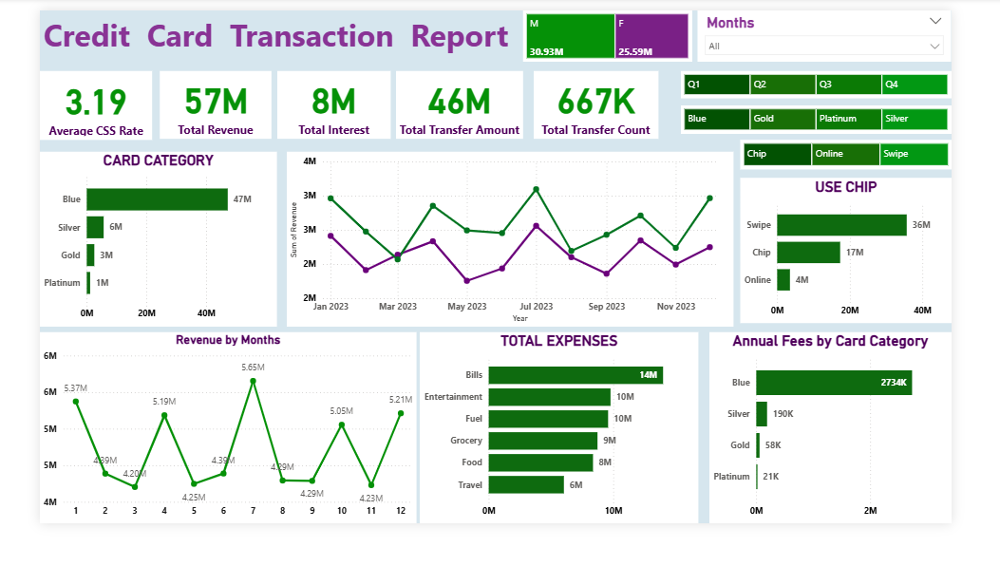
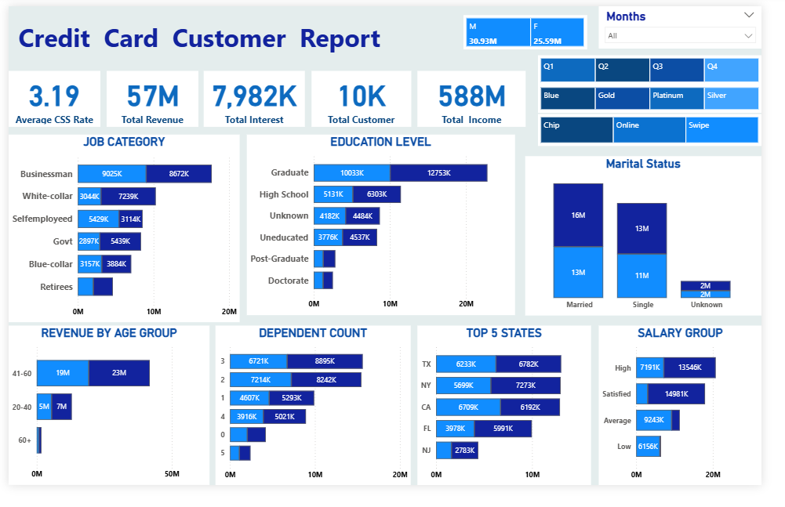

# Credit Card Financial Report

**Tools:** SQL (MySQL), Power BI

A weekly credit card report for 2023 that shows how much revenue the cards bring in, who the customers are, and how they spend.

## Business questions

- How much revenue, interest and transaction amount did the cards generate in 2023?
- Which card categories, payment methods and expense types drive revenue?
- Which customer groups (job, education, age, marital status, state, salary) bring the most revenue?

## Data

| File | Rows | What it holds |
| --- | --- | --- |
| `credit_card.csv` | 10,108 | Weekly card data: card category, fees, credit limit, transaction amount and count, interest earned, utilisation |
| `customer.csv` | 10,108 | Customer details: age, gender, education, marital status, job, income, state, satisfaction score |
| `cc_add.csv`, `cust_add.csv` | 185 each | New week's records appended to the main tables |

## Approach

1. **SQL** (see `Credit Card Sales SQL Query.docx`)
   - `UNION` inside CTEs to combine the main tables with the new week's records
   - joins between card and customer tables on `Client_Num`
   - `SUM`, `AVG` and `GROUP BY` for every KPI, and `ORDER BY ... LIMIT 5` for top states
2. **Power BI** (`credit card report.pbix`)
   - Two report pages: a **Transaction Report** and a **Customer Report**
   - Slicers for month, quarter, card category and payment method (chip, online, swipe)
   - Revenue split by gender on both pages

## Key results

| KPI | Value |
| --- | --- |
| Total revenue | 57M |
| Total interest | 8M |
| Total transaction amount | 46M |
| Total transaction count | 667K |
| Total customers | 10K |
| Average customer satisfaction score | 3.19 |

## Insights

- **Blue cards dominate:** 47M of the 57M revenue comes from Blue cards, so the business depends heavily on one card category.
- **Swipe is the main payment method** (36M), ahead of chip (17M) and online (4M).
- **Bills are the biggest expense type** (14M), followed by entertainment and fuel (10M each).
- **Male customers bring more revenue** (30.93M) than female customers (25.59M).
- **Top states** by revenue are TX, NY and CA.
- **Businessmen and graduates** are the highest-revenue job and education groups.

## Files

- `Credit Card Sales SQL Query.docx` – SQL queries for every KPI
- `credit card report.pbix` – Power BI report
- `credit_card.csv`, `customer.csv`, `cc_add.csv`, `cust_add.csv` – data
- `images/` – dashboard screenshots
